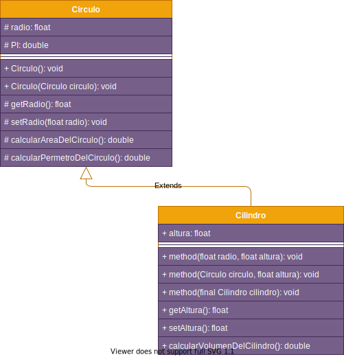

## Getting Started

Las práctica 3.1 y 3.2 fueron hechas a partir de la práctica original `2.2.Composición Punto-Círculo-Cilindro`. Las ramas correspondientes a las prácticas posteriores son:

- Para la práctica 3.1: `sin-punto` y `con-punto`, cuálquiera de las dos es válida, la principal diferencia entre esas dos ramas es que `con-punto` integra la clase `Punto` a la práctica con una composición a la clase `Circulo`, mientras que la rama `sin-punto` solo usa las clases `Circulo` y `Cilindro`, como recomendación personal, basarse en la rama `sin-punto` es la opción adecuada, dado que la profesora nunca pidió la integración de la clase "Punto" en la práctica 3.1.

- Para la práctica 3.2: El nombre de la rama es `composicion`.

Algunas otras cosas a tener en cuenta:

- En todas las ramas existe el fichero de la clase punto, pero en realidad este solo es usado en la rama "master" y "con-punto", por lo que recomiendo ignorar este fichero.
## Folder Structure

The workspace contains two folders by default, where:

- `src`: the folder to maintain sources
- `lib`: the folder to maintain dependencies

## Dependency Management

The `JAVA DEPENDENCIES` view allows you to manage your dependencies. More details can be found [here](https://github.com/microsoft/vscode-java-pack/blob/master/release-notes/v0.9.0.md#work-with-jar-files-directly).

## Diagrama UML

